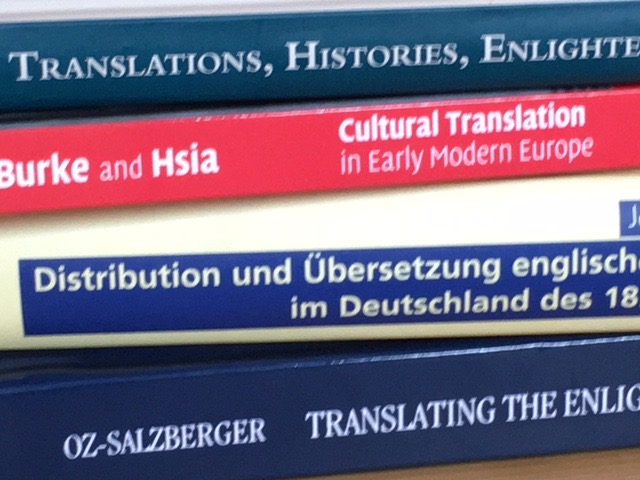
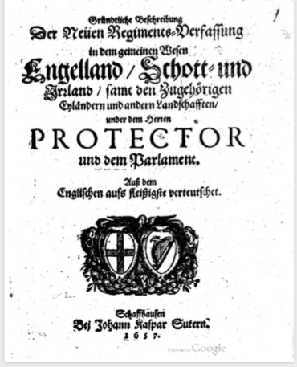
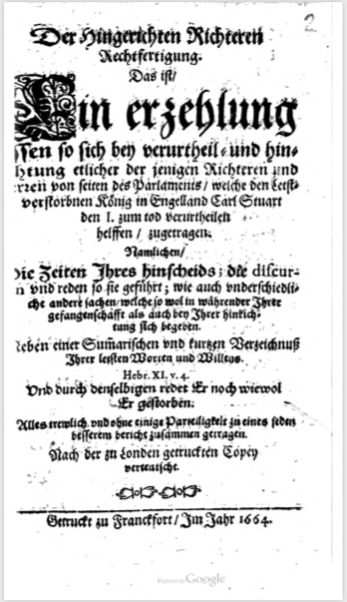
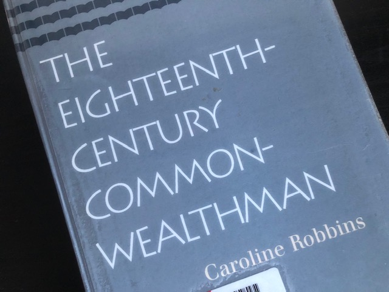

<!-- Custom style sheet -->
<link rel="stylesheet" type="text/css" href="../style.css">

  
Working with Translations in the History of Political Thought 
    Translations were crucial for the transmission of ideas and cultural transfer
  

  
As part of my project on ‘English republican ideas and translation networks in early modern Germany’, I look at the ways in which ideas from the English Revolution spread and were received in the German-speaking areas of Europe through the means of translation, and what potential impact they might have had on the constitutional debates before the revolutions of 1848-49.

**Translation Matters**

One reason why translations matter is that they were crucial for the transmission of ideas and cultural transfer between countries and cultures. Consequently, studying translations – how they were produced, how they travelled as physical objects, how they transported content, and how they were read and used – should give us some insight into these transfers. As our scholarly interests are becoming increasingly transnational, European and sometimes global, translation too is growing in importance for a more connected intellectual and cultural history.

While in the past historians of political thought might have read their Machiavelli or Bodin or Grotius in English as a fairly static text which was part of a canon of early modern political works, we are now much more likely to probe the quality of a translation, investigate how it came about, or how the translation process might have shaped the text itself and how it contributed to the way in which it might have been read and received. We are now much more aware of active readers as well as of translators as active intervenors into texts.
  

In the early modern period, translations were rarely ever just a straightforward transfer of a text from one language into another – if such objective or unmediated translations are possible at all. However, in a world in which authors had comparatively little control over the use of their works, translators were prone to take much greater liberties with a text than they might in the present day. They were both critical readers and editors of a text who might rework it for new audiences and contexts in a process which Peter Burke has called ‘cultural translation’. Translators might cut and rearrange a text, add explanations and footnotes as well as prefaces and commentaries.

By unravelling their work we might therefore learn something both about the original text and about the purpose for which it was intended, its original context and the target culture, and the cultural gap it was trying to bridge. As I am dealing first and foremost with political texts, I am particularly interested in the way in which political language was translated and how individual concepts describing political and legal entities, constitutional forms, or the political nation travelled between languages and cultures.

**Approaches and Methods**

Interesting work over the past decades has come from comparative literature, translation studies, book history, the history of reading and reader reception theory as well as other fields and sub-disciplines which have shifted the focus from the author and their perceived intention to the audience and the reader. My own interest in translation has probably been shaped most by cultural historians studying reading practices, marginalia, note taking as well as the significance of paratexts, including Kevin Sharpe, Anthony Grafton and Peter Burke.

The History of Political Thought more narrowly defined, meanwhile, has its own tools for this type of study, but still rarely applies them to translations as such. Among the approaches which have displayed a remarkable longevity for their usability are those of the Cambridge School and historical discourse analysis which arose from the linguistic turn, notably John Pocock’s identification of ‘political languages’ as ways of talking about politics with their own specific patterns and vocabularies, and Quentin Skinner’s focus on the speech acts an author was performing in writing a text and on the illocutionary force of these speech acts – whether intentional or non-intentional.

While both Pocock and Skinner have worked with translated texts, either from ancient Greek or Roman or from Renaissance Italian authors, and engaged extensively with terms and concepts such as ‘virtue’ or ‘liberty’ – both across languages and over time - translation has only played a peripheral or implicit role in the theoretical frameworks they employed to understand the ways in which the conceptual universe of classical republicanism, for instance, was adopted in seventeenth-century England. Some of their followers, meanwhile, have extended their approaches and addressed translation issues more explicitly. 

**Translations as Speech Acts**

As with any political text that is part of a wider political discourse, it is possible to see a translation as performing a speech act in the Skinnerian sense. We can ask the question: what was a person doing in producing any given translation?

However, then the story becomes more complex, as we need to find out who the actual agent making the speech act is here. Unlike a text published in its original language which ideally has an identifiable author (though early modern authorship itself is complex), a translated text has an original author and a translator who both have a stake in the text. In addition, in many cases the initiative for the translation does not come from the translators themselves, but the work is commissioned by a patron or a publisher.

An example for such a case is the German translation of Marchamont Nedham’s A True State of the Case of the Commonwealth of England, Scotland, and Ireland (1654), which appeared as Gründtliche Beschreibung Der Neuen Regiments-Verfassung in dem gemeinen Wesen Engelland, Schott- und Irrland (1657). It was published by Johann Kaspar Suter in the Swiss town of Schaffhausen and dedicated to the mathematician John Pell, who at the time was the English envoy to Switzerland, charged with winning the Protestant cantons for a protestant alliance headed by Cromwellian England. The translation was made in collaboration with Pell, who provided the original English text.

The pamphlet comes with a publisher’s dedication, a preface to the text, likely written by the translator, and the translation itself which needs to be read against an original text (which might also exist in different versions). They all they flag up the importance of the text, and they steer the reading process in a particular direction - in this case to recognise the shared identity and common bond of England and Switzerland as independent sovereign republics in the mid-seventeenth century.

The question, however, becomes: who is actually speaking? Is the speech act being made by Nedham as the original author of the work, or has it become the speech act of the anonymous translator. Or is it the speech act of the individual commissioning the work, in this case Pell or the English government? 

We might also consider the quality of a translation and how it might be measured. Should the quality, or rather the success of a translation be measured by how faithful the translator rendered the original text into its target language, or by how well the translated work was adapted for its purpose? 

There might also come a point at which the adaptation process takes over a translation, and the translator becomes the author of something new and very different. An example might be Mirabeau’s 1788 French version of Milton’s Areopagitica in defence of freedom of the press produced on the eve of the French Revolution. As its translator, Mirabeau took the original work, but radically reduced it in size, edited out many of the religious and cultural references which located it firmly in mid-seventeenth-century England and added his own spin for an eighteenth-century French audience – thus using the authority of an existing text to create something that is dependent on a source, but no longer a mere translation of it.

**Translating Political Languages**

A slightly different, but related question is how well political languages translate. Pocock’s political languages are units in themselves describing different conceptual worlds, e.g. the languages of Renaissance humanism and classical republicanism, the language of the ancient constitution and of the common law etc. If texts employing these languages are translated, the languages themselves need to remain recognisable. This might involve making considered linguistic choices and consistently using the same recognisable terminology or a political language might get lost in translation.

For a translation of a political language to be successful, however, the conceptual world they describe also need to make sense in both the original culture and the target culture. Within Western Europe with its shared cultural heritage and frame of reference, it might be possible to translate the language of classical republicanism from one vernacular into another. But it might be difficult to translate the same conceptual language into a non-European language and into a context which does not share the same cultural frame of reference.

The challenge of my current research project on the translation of English republican and Commonwealth works into German is to find out to what extent an identifiable English republican/ Commonwealth language was translated into German, or if indeed the translation of this distinct body of English works made it less distinguishable or recognisable as it was taken out of its original context and employed in another.

The question then is not just how well words, but the concepts and conceptual worlds they describe translate from one language and one culture into another. And this is where German Begriffsgeschichte or conceptual history comes in.

**Begriffsgeschichte**

Begriffsgeschichte as represented by the volumes of the Geschichtliche Grundbegriffe, edited by Otto Brunner, Werner Conze and Reinhardt Koselleck has focused on individual concepts within their broader semantic fields and explored their meaning in their social context over an extended period of time. Koselleck and his colleagues focused their investigations on what they considered the German Sattelzeit (or saddle period) between 1750 and 1850 – a period of accelerated social and political change which was crucial for the making of modernity, and in which many concepts relating to the state and its institutions came to develop their modern meaning. Their working assumption was that social and political change were reflected in semantic change, and that, conversely, by studying these key concepts we would better understand socio-political change.

However, like Pocock and Skinner, Koselleck and his colleagues did not pay much attention to translation from one contemporary vernacular language into another, while some of their followers do. Thus, in recent years, attempts have not only been made to apply Begriffsgeschichte to different historical periods, but also to extend it geographically into a transnational Begriffsgeschichte which looks at concepts across borders and languages, which comes with a whole lot of new problems and traps we should not fall into. 

In his work on liberalism, for instance, Jörn Leonhard has pointed out that semantic change did not necessarily happen at the same time and in the same way in different countries. Terms such as ‘liberal’ might look the same, but not actually mean the same in different contexts. While the French ‘idées libérales had become a universal concept for continental authors’ by the end of the Napoleonic Wars, for instance, and were used in Germany and Italy ‘to articulate new constitutional, social and national expectations’, in Britain the shift from ‘Whig’ to ‘liberal’ was slow – partly because of ‘the existence of pre-modern party names’, and partly because ‘liberal’ was long conceived as foreign and un-English.

Anthony Pym has pointed to a similar problem with the concept ‘democracy’ which ‘can mean radically different things in Pericles’ Greece, Real Socialism and consumer capitalism, even despite apparent equivalence on the level of translingual morphology.’ This is important to bear in mind when studying early modern democratising processes, for instance, because the danger is always that we project something back into the past that was never there. 

However, one can also turn this absence of exact equivalents into a positive and argue that translation is interesting exactly because of the little cultural differences between concepts, the not-quite-equivalent translations, which might point us exactly to that which is unique and distinctive in one context as opposed to another. And this is maybe where linguistic analysis and an approach via translation can be the most productive.

(This blog post was adapted from my introduction at the workshop on ‘Ideas and Translation in Early Modern Europe’ at Newcastle University on 22 April 2021.)

gm

  
An earlier version of this text was first published [here](https://thehistorywoman.com/2021/05/04/working-with-translations-in-the-history-of-political-thought/) 

  
Defending the English Revolution in the German Lands  
    Most published pamphlets were biased towards monarchy - but not all of them
  

  
In his study of the contemporary reception of the English Revolution in the German-speaking lands of continental Europe, Günter Berghaus stresses that a large majority of pamphlets published on the subject in German were biased towards the Stuart monarchy. This is little surprising given that the majority of territories were ruled by princes who were understandably unnerved by the recent regicide of Charles I, the overturning of the old order, and the establishment of republican rule. 

Needless to say, John Milton’s Pro Populo Anglicano Defensio (1651), written in Latin to justify the regicide to a wider European audience, and similarly seditious works were soon banned in the Holy Roman Empire. Apparently only few German-language pieces offering a parliamentary or republican perspective of recent events in England escaped the censors. 

However, there are at least two notable German translations of well-known English pamphlets in defence of the regicide and of the Protectorate which were circulating in the Empire regardless. Both are associated with political figures who participated in the events surrounding the English Revolution, and both were published in the cantons of the Old Swiss Confederacy which had separated from the Empire in 1648.
  

The first is a translation of Marchamont Nedham’s A true state of the case of the Commonwealth of England, Scotland, and Ireland (1654) published by Johann Kaspar Suter in Schaffhausen in 1657 as Gründliche Beschreibung der neuen Regiments-Verfassung in dem gemeinen Wesen Engelland, Schott- und Irrland. The second is Der hingerichteten Richtern Rechtfertigung (1663) based on The Speeches and Prayers (1660) ascribed to the regicides executed soon after the Restoration of the Stuart monarchy in England.

The Gründliche Beschreibung is dedicated by Suter to Joannis Pellius, or John Pell, the mathematician and then envoy of the Protectorate to the Swiss Confederacy. Suter’s preface reveals that the English pamphlet had been passed to the translator by Pell himself and that its translation into the ‘common language’ was intended to counter the widespread suspicions against and defamation of the new English government.

Pell had been sent to Switzerland by Oliver Cromwell to draw the Protestant cantons into a continental protestant alliance under English leadership, and the pamphlet is document to how close relations were during the mid-1650s. It defends the regicide as the necessary act of an oppressed people against its tyrannical ruler and the establishment of a new government to recover and protect the people’s ancient liberties.

Yet, the timing of the translation is odd. While Nedham’s original English version had been published in 1654 shortly after the establishment of the Protectorate, the translation is dated ‘Brachmonat’ or June 1657 and thus after the adoption of the Humble Petition and Advice on 25 May the same year. The Petition and Advice revised the original protectoral constitution in important ways, notably adding an ‘Other House’ of Army grandees to balance the popular assembly, and allowing Cromwell to nominate his own successor after he had rejected the Crown. 

However, the 1657 translation makes no allowances for this update, notably still stating that the Protector is elected. This raises the question if either the translation was so long in the making that it was overtaken by events (we do not know when Pell commissioned it), or that news was travelling so slowly that Pell was not aware of the recent changes in England. 

It is also possible, though less likely, that Pell was aware of the adjustments to the Protectoral constitution, but decided that they were insignificant for his purposes. There is also a chance that he was aware of the constitutional change and still had the pamphlet translated in its original form in protest at Cromwell’s assumption of new powers, especially the nomination of a successor. However, it would be strange to register such a protest in German rather than in English.

In any case, it was – for obvious reasons - easier to publish a republican pamphlet in the Swiss cantons than in the Empire, while the text could still circulate across the border too. 
  

Another pamphlet to travel from the Swiss Confederacy to the Empire was the French-language Les juges jugez, se justifiants (1663) containing scaffold speeches as well as miscellaneous letters and prayers ascribed to the first ten regicides executed under the Restoration government in 1660. It also contained material on the regicides John Barkstead, Miles Corbet and John Okey, who had been extradited from the United Provinces and were executed in 1662, and on the trials of Major General John Lambert and the Commonwealth politician Henry Vane the Younger. Vane had been sentenced to death, although he was not a regicide, while Lambert’s sentence was commuted to life imprisonment.

Les juges had equally been a work commissioned directly by an Interregnum politician. During his exile in Switzerland after the Restoration, the republican Edmund Ludlow had arranged for the regicides’ Speeches and Prayers to be translated into French to acquaint a wider audience with their plight and to promote the Protestant cause in French-speaking Europe and beyond. The printer meanwhile added further material on Barkstead, Corbet and Okey as well as on Vane and Lambert. The result was Les juges. 

Printed at Yverdon, the pamphlet apparently found its way into the Empire, where it was translated into German as Der hingerichteten Richter Rechtfertigung and published in Frankfurt in 1663. A reprint with a new title page appeared in 1664, but wisely none of the two versions carried a full imprint. While few English republican works might have been published in German at the time, it was thus not all royalist reading.

gm
  
An earlier version of this text was first published [here](https://thehistorywoman.com/2021/03/29/defending-the-english-revolution-in-the-german-lands/)

  
Re-reading old history books  
    Caroline Robbins’ Eighteenth-Century Commonwealthman (1959) is a real classic
  

  
Part of the joy of starting a new research project is that you get the chance to read a lot of new literature. I am currently reading about translation and conceptual history, book history and the history of English republicanism. But I am also actively re-reading a lot of older historiography I first came across when I got my teeth stuck into seventeenth-century English republican thought for my MA and PhD theses. One of the books I have recently re-visited is Caroline Robbins’ Eighteenth-Century Commonwealthman (1959), now a classic in its own right.

Of course, a lot of it was still familiar in a reassuring way. The authors it covers, John Milton, James Harrington, Henry Neville, Algernon Sidney, John Toland and Robert Molesworth, among many others - back then virtual strangers I was only slowly getting to know - have by now become old friends. 

Robbins’ narrative analysis about the transmission of English republican ideas from the mid-seventeenth-century to revolutionary America has burnt itself into my brain just like the narrative of J.G.A. Pocock’s monumental Machiavellian Moment (1975), which starts the journey of ideas in the Italian Renaissance, but still ends up where Robbins does, across the Atlantic.

Where Robbins’ work was a collective biography of English-speaking Commonwealth authors, bringing together brief life sketches of an extraordinary number of authors writing on cognate issues, Pocock’s work was the biography of an idea travelling continents.

However, the re-reading of any work after a long time also lets you see its flaws more clearly, in part because of the plethora of secondary literature that has been published in the meantime, criticising and revising the arguments as well as developing them further. 

Reading Robbins now makes me question her assessment of Neville as someone who ‘definitely accepted a part at least of the Restoration Settlement’, wonder why she considered Sidney a moderate in 1649, and why she decided not to include authors like Henry Vane the younger, who moved in the same circles as Neville, Sidney and Milton, and who had many admirers in the seventeenth century, but was more interested in the rule of the saints than in constitutional structures. 

The focus on classical republicanism at the expense of religious republicanism has been a noted feature of much of the historiography of seventeenth-century English political thought and perhaps skewed the picture of what political thinkers were engaging with at the time because a present-focused, teleological or Whig approach to history made us look for the things we could relate to and make use of in our present-day lives. 

Also absent from both Robbins and Pocock as well as from much of the literature coming out of the Cambridge School of the History of Political thought was an interest in non-canonical authors, or even ephemeral works whose authors we might never know, but whose output might have found much wider distribution at the time than that of a Harrington or a Neville.

Due to my own interest in translation and the European connections of English republicanism, of course, Robbins’ statement that she was aware of a ‘continental tradition’ of commonwealth ideas but decided that it ‘must here be ignored’ in particular stood out to me. (Pocock too acknowledged that republican ideas travelled from Europe to America but, at least within the Machiavellian Moment, did not address the ways in which they might have found their way back.)

Since the first publication of the Commonwealthman in 1959, much has changed, and work on the European contexts of English republicanism has been expanding, owing not least to John Morrill’s observation that the English Civil was the last of the European Wars of religion and Jonathan Scott’s snappier and more provocative comment that ‘The last act of the Thirty Years’ War, was not the Peace of Westphalia ... but the execution of Charles I’. 

It is nevertheless unfair to criticise earlier historians for not having seen what we see now, because they started from a different position. After all, the only reason we can see gaps in their research now is because they did this research in the first place – and we should not complain about the view which is offered from the shoulders of giants.

I am therefore just grateful that enthusiastic and enormously productive historians like Caroline Robbins existed who paved the way for many a PhD dissertation and new research projects on one of the authors she made better known to the world and who showed the value of a close reading of a great number of primary sources she so concisely summarised for easy reference.

Much older historiography meanwhile now seems spookily devoid of references to secondary literature, which in me always evokes nostalgia for a time when all that counted was good old primary research, close reading and contextualisation. But re-reading older works also makes me worry about the proliferation of new publications we have now, where so much is written on any given subject that it becomes increasingly hard to keep track even of the historiography in your own little area of expertise. 

So often do I find myself looking back to happier times, before the marketisation of Higher Education created the publish-or-perish mantra forcing scholars to write more and more about less and less, while also hoping that I will finally find the time that Caroline Robbins had to read all those primary sources.

gm

An earlier version of this text was first published [here](https://thehistorywoman.com/2021/01/22/re-reading-old-history-books/) 

