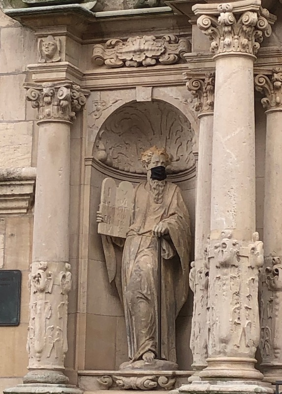
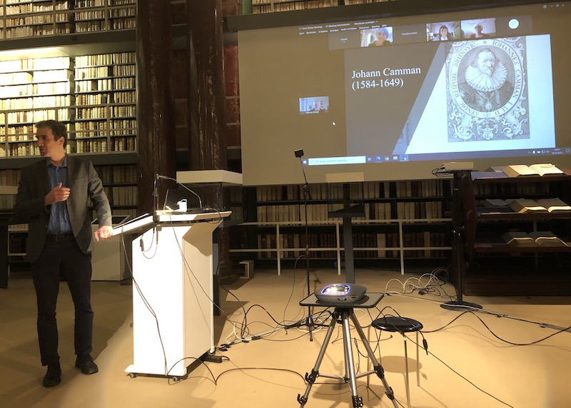
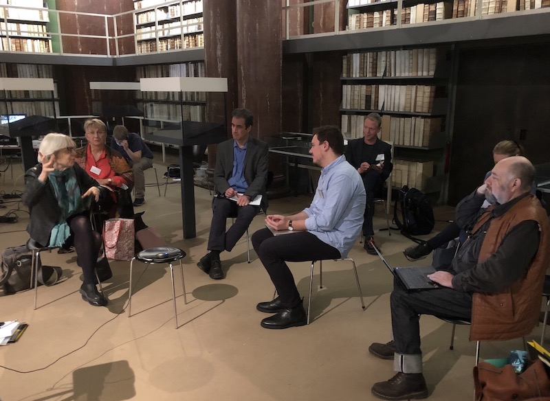
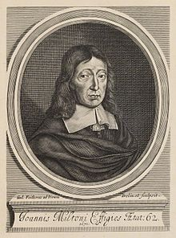
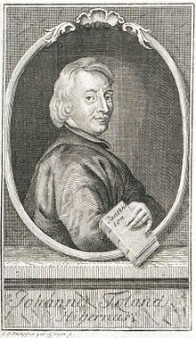
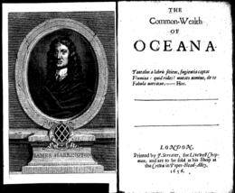
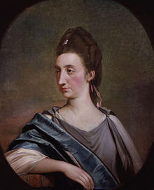

<!-- Custom style sheet -->
<link rel="stylesheet" type="text/css" href="../style.css">

  
Translating English Republican Ideas in Germany 
    Making a case for the significance of translation in the distribution and transmission of political ideas. 

  

As I am returning to my research project after a pandemic-induced break, it is time to renew my case for the significance of translation in the distribution and transmission of political ideas in early modern and Enlightenment Europe. I will do so with some notes I made for my paper at this year’s ISIH conference in Venice. The translation history of English republican works and ideas in Germany, as we know by now, is far from straightforward. While the legacy of English republicanism in the British colonies in America and its traces in the Declaration of Independence and in the American Constitution have been relatively well explored, and significant work has also been done on the reception of English and American ideas in the context of the French Revolution, the impact of English republican thought in Germany has been comparatively neglected. This is at least partly due to the assumption that Germany went down a separate path, or Sonderweg - often used to explain the rise of national socialism in the twentieth century - which sees the Enlightenment in Germany as largely unpolitical and the country lacking the degree of civic consciousness that characterized early modern England or France.

Germany never had a comparable Revolution to remove monarchical and feudal structures – despite the wave of liberal and democratic movements before 1848 - and found its national unity and identity relatively late. And when it did, it was largely in reaction to events in France and to the Napoleonic wars that followed the Revolution. Germany could thus be seen as rather conservative and anti-revolutionary with an intellectual culture that rejected radical political and constitutional change. If political thinkers praised England it was usually for the Glorious Revolution of 1689 to promote moderate reform over the radical destruction and renewal seen in late eighteenth-century France.

The moderate and conservative nature of the German Enlightenment, however, has more recently been questioned by scholars such as Martin Mulsow, who has detected an underlying radicalism among German intellectuals, in particular through the engagement with heterodox religious views which had been circulating among groups of radical thinkers, in particular English republicans and French Huguenots, in the Netherlands and travelled from there into the protestant North of Germany. Nevertheless, Mulsow does not think that the political ideas of those radical circles, notably English republican ideas, had any impact in Germany, while Diethelm Klippel has stated his surprise at the fact that eighteenth-century German readers should have been at all familiar with an English republican author like Algernon Sidney, who was translated into German in the wake of the French Revolution. But English republican authors might have been less obscure in Germany than we think.

**Translations and known editions** 

Between the mid-seventeenth and the late eighteenth century, we find, for instance, German-language translations of Marchamont Nedham’s A true state of the case of the Commonwealth of England stated (1654/1657), of Algernon Sidney’s Very copy of a paper delivered to the sheriffs, upon the scaffold on Tower-hill (1683/4) and of his Discourses concerning government (1698/1793), of Robert Molesworth’s Account of Denmark (1694/5), of John Toland’s Anglia Libera (1701), of John Locke’s Second Treatise of Government (1690/1718) and of Catharine Macaulay’s History of England (1763/1779). Some of these works, such as the translations of Sidney’s Last Paper and Molesworth’s Account of Denmark were published either under a false imprint or without publication details altogether.

**Works circulating in other languages**

Not all works had to be translated. Milton’s Defensio de Populo Anglicano (1651), for instance, had been purposefully circulated on the Continent in Latin to justify the regicide and the establishment of the English Commonwealth to a wider European audience. Some English republican works also circulated in Dutch (such as Sidney’s Scaffold Paper) or in French (such as Edmund Ludlow’s Memoirs (1699) and Sidney’s Discourses (1702)), and German translations might have been made via those bridging languages. The reception history of English republican ideas in Germany was therefore a multilingual one, influenced by the country’s geographical location in Central Europe, the variety of languages spoken and understood, and the workings of the European book trade with notable publishing centres in the nearby Netherlands. Despite those examples of works circulating in Germany, full translations of English republican texts into German were indeed few and far between, which is among others due to censorship legislation which prohibited the production, dissemination and consumption of works which could either upset the religious equilibrium or destabilise the political order. 

Nevertheless, from the later seventeenth-century onwards, educated German readers could learn about English republican authors and their ideas of popular sovereignty, the rule of law and religious liberty also through learned journals which provided reviews that often were little more than summary translations of the works discussed, and sometimes also translated extracts of those works verbatim. These summary translations and partial translations not only introduced English republican authors to a German audience, but also shaped their reputation and their legacy to a significant extent. One of the period’s most influential scholarly journals publishing such summary translations was the Latin Acta Eruditorum.

**English republican works in the Acta Eruditorum** 

The Acta, edited by Otto Mencke in Leipzig from 1682 and published in Latin for a European audience, was the first comprehensive review journal on German territory covering a wide range of disciplines. While professing to focus primarily on natural philosophy, the journal, published in a traditionally protestant part of Germany, also had a special interest in theology, usually representing an orthodox Lutheran point of view. Trailing through the late seventeenth and early eighteenth-century volumes of the Acta to see how English republican and Commonwealth authors might have been read in Germany, we find summary reviews of the works of John Milton, James Harrington, Edmund Ludlow, Algernon Sidney, John Locke, Walter Moyle and of John Toland himself. Not all of those works were political in the narrow sense. They included Milton’s Poetical Works, while the original tracts by Locke and Toland for the most part belonged to the debate about the Trinity and rational religion raging at the turn of the eighteenth century and beyond. 

The reception of English republican ideas went hand in hand with this religious debate and was at times overshadowed by it, but it might also help to explain how and why English republican works were read in Germany in the first place. The works we find reviewed here were fairly radical to say the least. They were written by regicides, defenders of the regicide, promoters of rebellion against unjust rulers as well as authors questioning traditional Christian teaching.

Yet, there was very little critical commentary on any work. This was due both to the Acta’s editorial policy, which was very cautious about religious tracts and explicitly excluded works ‘which attempted to undermine established authority’ and, I suspect, to the contemporary censorship legislation which would have influenced this policy. The Acta’s policy of neutrality was also intended to avoid scholarly disputes being fought out within its reviews. Its purpose was first of all to acquaint a broad scholarly audience of the content of recently published books from across Europe. Hence, the journal’s reviewers produced – often rather lengthy – summaries of the works they had been sent.

In their contributions we can see how reviewers for the Acta navigated their way carefully between moderate and radical ideas, presenting themselves as moderate on the surface while still reviewing, and in part reproducing, translating and paraphrasing, radical texts. 
Politically sensitive texts were thus reviewed with a critical distance, but they were still being reviewed and their ideas repeated and reproduced in the process. Thus, what Martin Mulsow has observed with regard to religious ideas might also hold true to some extent for political ideas: among the visible layer of moderate Enlightenment, there was always potential for more radical thought just below the surface.

**The Reviews**

Notably, among the English republican and Commonwealth works reviewed in the Acta around the turn of the eighteenth century were three works originally edited or re-edited by Irish Whig and freethinker John Toland in collaboration with the English bookseller John Darby. These were Ludlow’s Memoirs (1699), the Works (1701) of James Harrington, and Sidney’s Discourses (1702). Two of them, the Memoirs and the Discourses were reviewed in their French translation, not least because it was hard to come by reviewers able both to read English and also write in¬ Latin, as Mencke complained in a letter to Gottfried Wilhelm Leibniz who supported and regularly contributed to the journal. Further reviews included Toland’s own Life of Milton (1699) and the Works (1726) of Walter Moyle edited after Toland’s death by Thomas Sergeant, but equally published by Darby. Most of the works were reviewed within a year of their publication.

All of these republican and Commonwealth works were reviewed in a relatively neutral way with a critical distance which suggested that a review should not be considered as an endorsement of the author’s opinions. Yet, what matters is that the reviews were published at all and, through relating the content of the works in question, repeated the political positions of English republicans and even regicides for everyone – at least everyone with a decent knowledge of Latin – to read. The purpose of the reviews is therefore ambiguous, with the authors both spreading English republican ideas while at the same time distancing themselves from them. In what follows, I would like to use the example of a review of Toland’s Life of Milton by Johann Burckhardt Mencke, the journal editor’s son, to show the extent to which the Latin reviews were also a translation exercise. The most interesting part is the introductory section, which is essentially a disclaimer in which the reviewer officially distances himself from the content of the work he discusses, albeit not because of Milton’s, but because of Toland’s reputation.

**The Review of Toland’s Life of Milton as a Summary Translation** 

Introducing the book, Mencke junior notes that Toland’s Life of Milton had almost not been accepted for review because of its author’s reputation as a Socinian and Monarchomach, whose infamous tract Christianity not mysterious (1696) had only recently been burnt by the Irish Parliament. Already with ‘his first major publication’, as Justin Champion has pointed out, Toland had managed to antagonise many orthodox Christians and clergymen by asserting ‘that all fundamental doctrine was accessible to human reason unaided by the Church.’ And his reputation of heterodoxy had spread also to the Continent, where many joined into the debate about his work. After some deliberation, however, Mencke goes on, it had been decided to publish the review of Milton’s Life anyway, because none of Toland’s heterodox views appeared in the present work – disregarding, of course, his ‘defence of liberty and the critique of priestcraft’ - and because it had always been editorial policy to review books and their historical arguments without regard to their authors. 

Text and review correspond particularly closely in the earlier event-based part of the text, which is heavily focused on Milton’s early life, education and travels and his acquaintance with foreign scholars. The passages in which Toland discusses Milton’s works, in contrast, are more condensed, naming the works published at particular stages of his life with a brief description, but leaving out much of the detailed context and commentary added by Toland. 
This suggests that the main purpose of Mencke’s review might have been to establish some ‘key facts’ about Milton and offer a catalogue or bibliography of his published works, but not to provide any deeper analysis that could be considered partial in any way. 

Some passages of Toland’s text are translated almost verbatim, though leaving out some of the detail, such as an early section talking about Milton’s early life, his precociousness, and his failing eyesight as well as his time as a student at Cambridge and his knack for poetry, which he showed by translating the psalms into verse. A similar approach is used summarising the sections on Milton’s Grand Tour, during which he met Hugo Grotius in Paris, or talking about Milton’s return to London and his work as a tutor. The relevant information is copied out and translated. 

It gets more interesting, when we get to the passages dealing with Milton’s actual ideas and beliefs, as some caution was clearly in order, one would think. But Mencke still faithfully summarizes Milton’s main arguments. On the Areopagitica against pre-publication censorship, Mencke copies its exact purpose to show – despite strict censorship regulation in the German lands – that Milton had proven that the republics of Greece and Italy ‘never censur’d any but immoral, diffamatory, or atheistical Pieces.’ Mencke also faithfully reproduces the purpose of the Tenure of Kings and Magistrates written in justification of the regicide, which demonstrated, according to Toland, ‘that such as had the Power might call a Tyrant to account for his Maladministration, and after due Conviction to depose or put him to death.’ 

Only with respect to the Defensio Pro Populo Anglicano (1651), the official defence of the regicide, which had been banned in Germany at the time, Mencke obviously thinks it advisable to add explicitly that it was a pamphlet ‘pro mala quidem causa, sed elegantissima’ – a pamphlet written for a bad cause, but in a most elegant manner. Here Mencke was repeating a well-known contemporary judgement of Milton which had probably originated with the Dutch scholar Nicolaus Heinsius and was commonly repeated to acknowledge Milton’s talent, while (publicly at least) rejecting his politics.

Longer passages of text also sometimes are summarised in ways which were more heavily condensed to extract the facts, but also deliberately vague on the politics. For instance, a several page long discussion of Eikonoklastes by Toland, accusing either Charles I of ‘Royal Plagiarism’ in his spiritual biography Eikon Basilike, or rather his chaplain of sinister ‘Priestcraft’ for publishing ‘stolen’ material in the King’s name, which Milton uncovered, was reduced to a sentence stating rather neutrally that the tract  ‘was attributed to the King, but … was in actual fact written by Gaudenius, the bishop of Exeter, which Milton was able to show in Eikonoklastes.’ Large anti-clerical sections were also missing, or rather not repeated in the review, possibly also to avoid controversy. Mencke also comments rather dismissively on Milton’s declining faith towards the end of his life, thus showing more distance to the subject than Toland, who had likely seen Milton as a kindred spirit.

Mencke’s earlier claim to focus entirely on the book’s content rather than its author, meanwhile, needs to be taken with a pinch of salt. For, further down in the same review, he points towards yet another Toland publication, deliberately drawing attention to other republican works one might want to read for comparison. Discussing Milton’s Ready and easy way to establish a free commonwealth (1659/60), Mencke repeats Toland’s view that Milton’s ‘model of a commonwealth’ was ‘inferior, in all respects, to Harrington’s Oceana’, and that the Acta was going to review Harrington’s Works with a life of the author soon. Far from avoiding Toland’s works because he was associated with heterodox religion, it seems that Toland’s notoriety rather helped to raise interest in and popularise his other publications, including his editions of English republican works. The Acta would go on to review both Toland’s edition of Harrington’s Works and the French translation of Sidney’s Discourses as well as Ludlow’s Memoirs.

**Traces of Toland’s Life of Milton as presented in the Acta** 

The Acta were more than a review journal, however. They also became an important source and reference work for later authors, and those gathering information on Milton and other English writers would refer back to the reviews and thus also to Toland. The translation effort made by the reviewers therefore had a lasting effect, and references to the review could, for instance, be found in later German Encyclopaedias or other works on Milton. While the review of Toland’s Life of Milton is only one example, it shows how learned German readers might handle, engage with and respond to English republican and Commonwealth ideas, even though these might not always have been comfortable encounters. The reviews in the Acta and the fact that quite radical content was published by an otherwise respectable, mainstream journal – albeit with some critical distance and health warnings - also hint that underneath the moderate and conservative German Enlightenment described in much of the secondary literature there was always potential for something more radical just under the surface. 

gm

27/10/2020
  

    

  
Translating Cultures workshop at the Herzog August Bibliothek goes hybrid
 
    The event at the HAB in Wolfenbüttel addressed 'Ideas and Materiality in Europe' this year. 

  

This year's 'Translating Culture' workshop (18-19 October) was unusual in many ways. Having postponed the event several times due to the ongoing Coronavirus pandemic, Thomas Munck and I eventually decided to run it as a hybrid event with the majority of participants on-site at the Herzog August Bibliothek in Wolfenbüttel and a smaller group joining the meeting remotely from home in the UK and in France. This was made possible by the excellent facilities at the HAB allowing on-site and remote participants to communicate freely. 
  
    
  
The event on 'Ideas and Materiality, c1500-1800' kicked off on Monday morning with a brief welcome from the library’s director Peter Burschel and introductions by ourselves followed by three papers on Oriental scholarship in early modern Europe. 
  
In her paper, ‘Translating the Ottoman Empire: the ideological use of translations of works about the Ottomans’, Ann Thomson explored the different ways in which texts were transformed through translation, each significant amongst readers in raising awareness of the Ottoman world, but with different underlying intentions. Paul Rycaut’s *History of the Present State of the Ottoman Empire* (1668), published after the Restoration of the Stuarts, for instance, originally juxtaposed oriental despotism with the benevolent rule of Charles II to counter the claims of the dissenters. The 1670 French translation by Pierre Briot, meanwhile, adapted the work to French sensibilities, dropping both the references to England and the epistle to the reader, while another French rendering by the pastor Henri Despier showed a particular interest in the Muslim sects described by Rycaut and drew parallels between their situation and that of the Huguenots in France. Despier thus used a narrative about the Ottoman Empire and Islam to criticize the persecution of Huguenots on the eve of the Revocation of the Edict of Nantes. 

Similarly, James Porter’s *Observations on the Religion, Law, Government and Manners of the Turks* (1768) was translated into French by Claude François Bergier soon after it appeared and published in Paris in 1769. A new edition/ reprint appearing in Neuchâtel in 1770, however, added numerous footnotes opposing religious persecution, thus turning Porter’s work into a manifesto against Catholic intolerance in France.

Asaph Ben-Tov offered the case study of ‘Johann Camman Jr (1584-1649) and the Story of Joseph: A Brunswick lawyer reading the Koran’. Taking Camman as his starting point, Asaph demonstrated the extent to which amateur scholars in early modern Germany engaged with the ‘Turkish Bible’ not just for religious reasons but also out of sustained interest in both interlinear (literal) translation from Arabic and more culturally sensitive renditions. He also amassed a library of nearly ten thousand volumes, demonstrating his interest in scholarship and language learning. With his large library and transnational network of correspondents, Camman might have been a remarkable figure, but he was by no means a ‘lone wolf’ or ‘eccentric’. On the contrary, Asaph argued, Camman’s interest in Arabic was shared by many contemporaries inside and outside of the academic world.
  
    

Luisa Simonutti reflected on ‘Translation and toleration: an abridged version of Doctrina Mahumet in Locke’s papers’. Taking as her starting point a manuscript kept among the papers of the seventeenth-century thinker John Locke, Luisa explored how the dialogue between the prophet and the rabbi might have come to Oxford and to what purpose it might have been used by Locke. She noted the importance of manuscript transmission (rather than print), but also recognised the questions of attribution and authorship associated with heavily annotated manuscript copies. In particular, she highlighted the way in which Islam features frequently in Locke’s writings on religious toleration and contributed to ideas about doctrinal unity. Contemporary interest in orientalism, she argued, went beyond an understanding of languages to an understanding of religion and cultures and also helped to contextualise the Christian Bible. Hence, works such as the *Doctrina Mahumet* were read by the likes of John Milton, John Locke as well as John Toland.

In the afternoon sessions, Thomas and I presented papers on the difficulties sometimes encountered in cultural translation and the politics behind a tract which had been written with several European translations already in mind. 

In his provocatively titled paper, 'Untranslatable, unsellable, unreadable? Obstacles, delays and failures in cultural translation in print in early modern Europe', Thomas posed the question why some works were translated widely in the early modern period while others were not. As an example, he used the case of John Milton, who was among the most popular and most controversial authors of the seventeenth century and yet his political writings (in contrast to *Paradise Lost*) were not as widely translated as might be expected. According to Munck, several things might have made a text ‘unstranslatable’, including a lack of high-quality dictionaries or simply a lack of skill on the part of a translator; differences in the conceptual framework of the original text and the target language; ideas which were too complex, unsuitable or simply too boring to warrant translation; or various forms of censorship or fear of persecution. Texts originally written in marginal languages or originating in the periphery of Europe were less likely to gain wider dissemination through translation.

My own paper engaged with ‘The language politics of John Toland’s *Anglia Libera* (1701)’ to explore the different purposes a political tract might have served in its original form and in translation and on the multiple audiences it might have addressed. Using the tract authored by the Irish Commonwealthman and freethinker Toland to convey the terms of the Act of Settlement to the Hanoverian Court, I showed the variations between the original English text and its German translation posing the question why the Court at Hanover might have wanted to suppress the translation, sale and distribution of this controversial work.

The first days’ panels were then followed by several shorter research updates from Rachel Hammersley, Laszlo Kontler and Myriam-Isabelle Ducrocq. Each provided updates on the research they had presented at the group's earlier workshops, and how it will feed into the planned edited volume of papers arising from this research group. 

Speaking remotely from Newcastle, Rachel updated the group on her new research project ‘Experiencing Political Texts’, which engages with the materiality of early modern texts and their contemporary reception as well as with means of conveying this materiality in the digital age. This research will be directly relevant to our edited volume of papers. Both Rachel and Myriam-Isabelle will be contributing chapters on the French reception of the seventeenth-century English republican James Harrington in Revolutionary France to the collection, with Hammersley focusing on ‘Beyond translation: the political uses of the works of James Harrington during the French Revolution’ and Ducrocq on ‘Translating Harrington in Thermidorian France: Henry's *Oeuvres politiques de Jacques Harrington, Ecuyer* (1795)’. 

Laszlo Kontler outlined the plans for his chapter on ‘Non-contemporaneous contemporaries: liberal reform by translating the (long) Enlightenment [Hungary in the early 19thC]’, which will require him to go through the archival deposits of a learned Hungarian journal in an attempt to understand the journal’s policies on the review and translation of contemporary and earlier Enlightenment works, and how far these policies were part of a top-down agenda or driven by individual writers.

The panels on Tuesday engaged with the translation of a range of works, both fictional and scientific, not just as case studies in their own right, but also as innovative ways of using print to explore the potential for change in early modern society.

Alessia Castagnino focused on scientific works with ‘The Italian reception of Nöel-Antoine Pluche’s *Spectacle de la Nature* through the lens of translations’. Pluche’s Spectacle, published in nine volumes between 1732 and 1742, was an eighteenth-century bestseller with 57 editions published in French and numerous translations into other European languages. It was written in the form of a dialogue between a noble student, his parents and his tutor, and didactic in nature, so it would become a popular teaching tool. Pluche’s Italian translators, Alessia argued, made his work even more easy to read, while the octavo format of the translation also made it inexpensive and aided its wide distribution. 

Amelia Mills offered a paper on ‘Translating the *Carte de Tendre*: the cultural transmission of a map of courtship from Madeleine de Scudéry’s French salons to Aphra Behn’s English readers’. This map had been intended as a guide for a potential suitor to the affections of a woman and offered different routes the suitor could take from ‘Nouvelle Amitié’ or friendship to tenderness. Considering Scudéry’s original map too prudish, however, later imitators adapted the map or produced their own with a greater focus on passion and love and more erotic destinations. In her *Poems upon Several Occasions; with A Voyage to the Island of Love* (1684), the English author and translator Aphra Behn, however, recovered Scudéry’s original idea of winning a woman’s affection through appealing to her intellect.

Mark Somos, Francesca Iurlaro, Edward Jones Corredera and Lara Muschel then took the workshop participants on a journey with ‘The yacht of Theseus: navigation and transmission with the 1633 *Mare liberum*’. The paper gave an overview of their worldwide census of extant copies of Hugo Grotius’ *Mare liberum*, including all known reprints and translations by 1650. This research will not only map the dissemination of this major work on international law, but also highlight how detailed bibliographical information can enhance our understanding of the material culture of early modern print, the complexities of different printings, and even the visual impact of each edition. 

In the final paper, Luc Borot explored ‘The manifold strategies of 17th-century translators: the case of Du Verdus as translator of Thomas Hobbes’. As an ardent admirer of Hobbes, the Gascon gentleman François Du Verdus aimed to translate his work into French. While he was successful in translating Hobbes’ *De Cive* from the Latin, however, he was forced to abandon his translation of Leviathan from the English because his linguistic skills were simply insufficient. Nevertheless, his correspondence with Hobbes about Leviathan, as Borot showed, is evidence of the close engagement of Du Verdus with the text itself and between author and translator. For Hobbes not only corresponded with Du Verdus about his translation efforts, but even sent corrected versions of chapters back to him. Borot outlined what Du Verdus' intentions might have been, in undertaking such an ambitious project.
  
    

**Programme**

**Day 1**

Welcome and Introduction: Thomas Munck (Glasgow, online) & Gaby Mahlberg (Newcastle, on site)

Panel 1:

Ann Thomson (Florence), ‘Translating the Ottoman Empire: the ideological use of translations of works about the Ottomans’

Asaph Ben-Tov (Erfurt), ‘Johann Camman Jr (1584-1649) and the Story of Joseph: A Brunswick lawyer reading the Koran’

Panel 2:

Luisa Simonutti (Milan), ‘Translation and toleration: an abridged version of *Doctrina Mahumet* in Locke’s papers’

Panel 3:

Thomas Munck (Glasgow), ‘Untranslatable, unsellable, unreadable? Obstacles, delays and failures in cultural translation in print in early modern Europe’

Gaby Mahlberg (Newcastle), ‘The language politics of John Toland’s *Anglia Libera* (1701)’

Roundtable I:
 
Updates on research ideas and projects by Rachel Hammersley, Myriam-Isabelle Ducrocq and Laszlo Kontler (and everybody).

**Day 2**

Panel 1:

Alessia Castagnino (Milan), ‘The Italian reception of Nöel-Antoine Pluche’s *Spectacle de la Nature* through the lens of translations’

Amelia Mills (Loughborough, online), ‘Translating the *Carte de Tendre*: the cultural transmission of a map of courtship from Madeleine de Scudéry’s French salons to Aphra Behn’s English readers’

Panel 2:

Luc Borot (Montpellier), ‘The manifold strategies of 17th-century translators: the case of Du Verdus as translator of Thomas Hobbes’

Mark Somos, Francesca Iurlaro (online), Edward Jones Corredera, and Lara Muschel (all Heidelberg), ‘The yacht of Theseus: navigation and transmission with the 1633 *Mare liberum*’

Panel 3: Roundtable with a focus on the planned edited volume 
  
The event was funded by the Thyssen Foundation and the HAB.  

gm
  
03/11/2021  

(An earlier version of this text was published here: https://translatingcultureseurope.wordpress.com/2021/10/23/workshop-report-18-19-october-2021/)
  

   
  

  
Legacies of English republicanism – a workshop report
 
    English republican ideas could re-emerge in new forms and in unexpected places.

  

 
At our workshop on ‘Commonwealthmen & Women: The Legacy of English Republicanism in Britain and Europe’ at Newcastle University we walked in the footsteps of Caroline Robbins – and yet we did not. Where Robbins had traced the long-term legacies of English republican ideas in a Commonwealth tradition which crossed the Atlantic from Britain to the American colonies, we explored primarily their British and continental European afterlife.

The day went off to a good start with a paper by Esther van Raamsdonk (Warwick) on ‘John Milton in the United Provinces’, exploring the transnational reception of Milton’s work. The regicide of Charles I in England in 1649 was widely condemned across Europe, and the reaction in the United Provinces was no different, despite the country’s republican constitution. It was therefore less surprising than one might think that the King’s defence, the *Defensio Regia* (1649), was published in Amsterdam, albeit written by the Frenchman Claude Saumaise, better known by his Latin name as Claudius Salmasius. 

To this royalist tract, John Milton responded on behalf of the English Commonwealth with his famous *Pro Populo Anglicano Defensio* (1651), which contained not just a powerful defence of the English people and their actions but also a scathing attack on both the arguments and the character of Salmasius. Its reception meanwhile was ambiguous.
  
  

The Heinsius and Vossius families, for instance, as Esther van Raamsdonk showed, were delighted with Milton’s attack despite their rejection of the regicide. This was mainly due to their dislike of Salmasius as well as their admiration for Milton’s Latin skills. Like many other scholars of the European Republic of Letters, they discussed Milton’s tract favourably while distancing themselves from its content. The criticism of Milton’s argument and the fact that copies of his work had been burnt in Paris and Toulouse, meanwhile, helped to generate even more interest in the English republican and his writings and made him a household name.

My own paper on ‘John Toland, the *Acta Eruditorum* and the reception of English Republican Ideas in Early Modern Germany’ came to similar conclusions for the turn of the eighteenth century. Triggered by John Toland’s new editions of English republican works as well as by their editor’s notoriety as a religious controversialist, German scholars too discussed English republican ideas, while at the same time distancing themselves from anti-royal sentiments, regicide, rebellion or religious heterodoxy. 

  
  
Reviews in scholarly journals such as the Latin *Acta Eruditorum* served as a safe place to engage relatively openly with English republican thought in the face of censorship, although their authors had to navigate their path carefully between repeating radical ideas while at the same time advocating moderation.

To what extent either English republican ideas and religious freethought or the ideas of the Dutch thinker Benedict de Spinoza influenced a ‘radical Enlightenment’ in Europe has been an ongoing debate among historians following either Margaret Jacob or Jonathan Israel. I never thought it had to be an either-or. Surely both English and Dutch radical ideas played an important role and would have been in dialogue with each other, although the late seventeenth and early eighteenth-century habit to call all religious heterodoxy Spinozism certainly does not help.

Thomas Munck’s paper on ‘Spinoza, English republicanism and the origins of visionary democracy: revisiting a long-running debate in the light of self-censored texts’ engaged with Israel’s claim about the broad influence of Spinoza and turned it on its head by asking whether or not Spinoza himself would have been familiar with English authors.

While Spinoza lived a relatively modest life and did not own much more than about a hundred books at the time of his death, as Thomas Munck (Glasgow) pointed out, he would still have had multiple opportunities to learn about the writings and ideas of his English contemporaries. He owned a copy of Thomas Hobbes’s *De Cive* and might well have known his *Leviathan*, not least because Spinoza knew the work’s Dutch translator. 

Spinoza was also friends with the De La Court brothers as well as with many dissenters and refugees from England, especially Quakers, and he had a number of correspondents in England through which he would have heard about important works. While he was unlikely to have read James Harrington’s *Oceana* or other English republican writings, he was likely aware of them through his circles. Overall, however, Spinoza considered the English overthrow of the monarchy as insincere and Oliver Cromwell’s rule as a quasi-Restoration – a false republicanism based on wrong foundations – while his own preference was for a commonwealth of well-educated citizens, a utopian democracy.

Joseph Hone (Newcastle) and Ashley Walsh (Cardiff) then turned to the Commonwealth tradition in England and Scotland which by the late seventeenth and early eighteenth century had come to focus increasingly on ancient constitutionalism. While the Commonwealth tradition is usually seen as a prose tradition, however, the English Lit scholar Joseph Hone drew our attention to the importance of poetry in radical thought at the turn of the eighteenth century with a paper on ‘John Tutchin and Commonwealth Poetics’.

Tutchin, he suspects, might have been the author of both a collection of rhymed fables entitled *Aesop at Amsterdam* (1698) as well as of *The Foreigners* (1700) associated with the radical printer John Darby, who was Toland’s collaborator in the republication of English republican texts. Tutchin’s poems had a distinctly republican flavour, celebrating freeborn subjects, disobedience and even rebellion to tyrants. In particular, Tutchin’s works contrasted slavishness with native English freedom and the spirit of Saxon liberty, as Joseph Hone showed, revealing English Commonwealthmen to be rather more nationalist and less cosmopolitan than often suggested. 

Ashley Walsh’s paper on ‘The Eighteenth-Century Standing Army Debate in Britain’ showed the significance of a citizen militia for both English and Scottish Commonwealthmen. Paired with martial and patriotic values, Saxonism flourished throughout the eighteenth century – and in republican thought. However, the enthusiasm for a citizen militia was rather greater among the English than the Scots overall, Walsh argued, as the commercial interest feared losing cheap labour to military service. Scotland eventually had a militia imposed on it against its will. 

The discussion on the two papers then focused on the question whether or not the Commonwealthmen’s admiration for England’s ancient constitution should be seen as nationalist or whether Saxonism too could be considered as transnational and European. The nativist, ethnic/ racialist mindset behind it is certainly open to various interpretations. While the English used to claim the ancient constitution all to themselves and considered themselves the only free people left in Europe, as Ashley Walsh pointed out, the terms ‘English’, ‘Saxon’ and ‘German’ were also often used interchangeably.

While citizenship for English republicans was closely bound up with military service, it was equally closely connected to landownership. James Harrington had observed in his *Oceana* (1656) that the political power in a country tended to follow the distribution of land. As a consequence of the redistribution of land in England the country’s monarchy and aristocracy had increasingly been losing power in favour of the lesser gentry and the commoners, so that Civil War had become inevitable in the mid-seventeenth century and England was naturally headed for a mixed government in which the popular element dominated. The democratisation of the country was thus tied to a redistribution of property.

Rachel Hammersley (Newcastle) explored this train of thought in her paper on ‘The Persistence of English Republicanism: Land and Citizenship, 1656-1900’. She argued that eighteenth- and nineteenth-century republicans had similar concerns to their predecessors and that republicanism and land reform were therefore closely related. 

In a pamphlet on *Liberty and Right* (1747), for instance, John Campbell had adopted Harrington’s rule on inheritance to limit property ownership and thus distribute land and political power more widely among a larger number of people. The English radical Thomas Spence, meanwhile, broke the link between land ownership and the vote when he argued for a redistribution of land, while Charles Bradlaugh also tied the ownership of land to a duty of cultivation.

While the previous speakers had engaged with the material basis of political power, Christopher Hamel (Rouen) shifted the focus to its intellectual foundations with his paper on ‘Liberty as self-government. Richard Price's republicanism’. While J.G.A. Pocock contrasts rights and virtue in his analysis of classical republicanism, Christopher Hamel stressed that the two concepts go together in the political thought of Richard Price, who in turn could draw on thinkers like Algernon Sidney, John Trenchard and Thomas Gordon.

Both papers were linked by the question of sources: while later republican and Commonwealth thinkers frequently lifted ideas from their seventeenth-century predecessors, they did not always reference their authorities. This might make us wonder to what extent it might have been either opportune or inopportune to be associated with political or religious radicalism to appeal to different audiences at different times.

  

The two final presentations were both reports on ongoing projects. Max Skjönsberg (Liverpool) spoke about ‘Editing Catharine Macaulay's Political Writings’, while Allen Reddick (Zurich) presented his exploration of ‘The Hollis Collections in Europe’. Both projects are to an extent exercises in intellectual biography which attempt to reconstruct the mental worlds and motivations of two rather eccentric figures which in their own ways have shaped the English republican canon. 

A key problem with Macaulay, however, is to what extent we can describe her as either a republican or a commonwealthwoman at all, or whether another label might be more appropriate for someone who frequently quoted Tories or even Jacobites. Arguing that late eighteenth-century political debates could not be usefully divided into Whig or Tory, radical or moderate, Max Skjönsberg pointed out that members of Macaulay’s own circle called themselves rather ‘the friends of liberty’, while ‘patriot’ was also a term often used and appropriated by them. The term ‘patriot’ was associated with the country party and thus a set of principles which opposed the growth of the fiscal-military state and might fit better to describe a complex character like Macaulay.
  
  

While the various authors discussed over the course of the workshop might not easily have fitted into a box, however, Thomas Hollis clearly saw connections between them which identified them as part of a wider Commonwealth tradition. Over the course of his life, he spent a considerable amount of time and money on commissioning new editions of English ‘liberty books’ and sending them into the world either in the hope that they would have a positive effect or simply to know they would be preserved. Hollis sent book donations containing the works of Milton, Sidney and Harrington to libraries in England and in the American colonies, but also to the universities of Leiden, Utrecht, Göttingen and Leipzig, to Catania, Palermo, Bern, Zürich or Malta.

As Allen Reddick pointed out, Hollis even sent books to countries in which few people could be expected to read or understand English. Sometimes, he accompanied his donations with Walton’s Latin-English dictionary or Samuel Johnson’s English dictionary, but he also used imagery and iconography. Everyone who has seen a Hollis volume, will easily recognise the gold embossed images of Britannia, the owl, the lyre or the liberty cap.

The striking vermillion red of many Hollis volumes, meanwhile, as well as the gold embossed images might have been influenced by Hollis’ own travels, in particular his trip to Germany, where he visited the famous Kunstkammer of Augustus the Strong in Dresden, which left a lasting impression on the art lover, as Allen Reddick explained. The fact that the Hollis volumes are instantly recognisable to any student of eighteenth-century political thought surely shows that the eccentric collector’s mission was not all in vain.
 
gm

22/09/2021
  

  

  
Selling Milton’s Defensio in early modern Leipzig 
    A printer or bookseller's economic activity does not necessarily allow for conclusions about their politics.
  

 
John Milton’s *Pro Populo Anglicano Defensio* (1651) was one of the most controversial publications of its time. It defended the trial and execution of Charles I carried out by the Rump Parliament on behalf of the English people. The regicide had sent shockwaves through Europe. The rebellion of a people against a monarch, who claimed his position by divine right, in the name of popular sovereignty overturned the established order and might set a dangerous precedent for other countries.

Milton’s *Defensio* was written in response to Claudius Salmasius’ *Defensio Regia pro Carolo I* (1649), which had made the case for the King and condemning the actions of his English subjects. But Milton’s text was also a powerful manifesto for popular sovereignty, the right of rebellion against tyrants and religious liberty.

Milton had written the pamphlet in Latin on behalf of the Commonwealth government, and numerous editions of it, most of them printed in the United Provinces, were distributed across the Continent. Public reactions to it were almost exclusively negative, and copies of the pamphlet were publicly burnt in Paris and Toulouse. Given how many copies still survive in libraries across Europe to this day, however, this public outrage must rather have increased than diminished interest in the work, so much so that booksellers might have seen good business in stocking it.

My most recent research trip took me to the City Archive in Leipzig, which holds censorship documents relating to the case of the bookseller Tobias Riese, who was caught selling copies of Milton’s *Defensio* ahead of the city’s Easter book fair 1652 - to the dismay of the Elector of Saxony.
  

  
Günter Berghaus first drew attention to the case in the early 1980s because the edition sold by Riese had not been known before. It must have been a pirated version, reprinted locally by Johannes Bauer for Riese. 

While Berghaus was mainly interested in the existence of this previously unknown edition of the *Defensio* and in the way in which the authorities attempted to suppress it, I wanted to know if the documents in Leipzig might also tell us a bit more about Bauer and Riese’s motivation for producing and selling it. While I was perhaps hoping to find out something about their politics, the evidence points rather to economic considerations. Here were two businessmen trying to make profit from an international bestseller, as can be seen from Riese’s subsequent dispute with the Saxon authorities as documented by Berghaus.

The Elector wrote to the Council of Leipzig on 3 May ordering the officials ‘to confiscate every copy of this book that you can possibly obtain and send them ... to our High Consistory.’ On 22 May, the Council responded reporting about the book fair, saying they had not been able to trace any copies of the *Defensio* and that Bauer and Riese denied having published the book.

Disregarding their denial, Bauer and Riese were fined 100 Reichstaler – a fine which Riese was unwilling and, according to his own words, unable to pay. In October, the bookseller paid 12 Reichstaler and petitioned the Elector for a reduction of the fine. Although the Elector was not pleased, because Riese should have known better than to offer for sale ‘books which oppose the lawful authorities’, he did eventually agree to reduce the fine to 50 Reichstaler. However, Riese responded with another petition, asking that the remainder of the fine should be lifted, since the Elector’s sanctions against him had already put him at a business disadvantage against foreign and other booksellers in the city.

‘Milton’s tract is being brought here and stocked by foreign booksellers in large amounts, even after the book fair, and is sold to resident and other booksellers.’ This was unfair, Riese argued, for ‘They have never been forbidden to sell this tract, only I alone.’ Out of respect for the Elector, he had put his copies aside and was now keeping most of them in storage, while other competitors were free to sell their copies and make a profit from them. However, Riese was ‘left with mine to my personal disadvantage.’

It is probably not surprising that Riese would argue from an economic point of view rather than trying to defend the sale of a politically sensitive work. But it is also interesting that Riese points out that he was at a disadvantage compared to foreign booksellers who were not subjected to the same control as him. He therefore pleaded with the Elector to treat him this time as he would a foreigner (‘mir aus gnaden für dieses mahl fremdlings recht Wiederfahren Lasen’).

The Council, possibly out of a wider concern for the city’s flourishing book trade, in December also interceded on behalf of Riese, whom they considered ‘a quiet and obedient citizen’, arguing that the Elector’s sworn subjects should be given ‘the same licence as foreign and other booksellers, who were everywhere able to offer Milton’s tract for sale, particularly since the book was never confiscated and is to be found in every censored and approved fair catalogue.’ 

Even more interestingly, the Council argued that it was unusual for the Elector to intervene in the sale of Milton’s tract, when ‘traditionally, there had rarely been any restrictions on the sale of such books, likewise those of Papists, Calvinists and other heretics’, adding that the publication of such tracts gave scholars the opportunity to engage with them and refute them, thus ‘allowing the profound truth to emerge more clearly.’

As Berghaus points out, we do not know what the outcome was, and if Riese ever had to pay the remainder of his fine. However, we learn a lot about the economic reasons for publishing Milton’s *Defensio* aside from any political motivations which might or might not have existed. We should therefore be careful – in the absence of any other corroborating evidence – to jump from a printer or publisher’s economic activity to conclusions about their political views. While links between the two might exist, this is not always a given.

gm

21/08/2021
  
**

All quotes are taken from Günter Berghaus, ‘A Case of Censorship of Milton in Germany: On an Unknown Edition of the Pro Populo Anglican Defensio’, Milton Quarterly, 17 (1983), pp. 61-70.

The original documents of the case can be found in the Leipzig City Archive, Bücherzensurakten, I, 1600-1690, XLVI, vol. 152, fols 9-20.
  

  

  
Writing Book Reviews at the Turn of the Eighteenth Century 
    A review gives the reader an idea of the work’s content and its quality. The Acta Eruditorum followed a different strategy.
  

I enjoy writing book reviews, especially when I like the book I’ve just read. Analysing the structure and argument of someone else’s work helps you learn about what works and what doesn’t. Ideally, it will help you improve your own writing.

Academic book reviews can be a minefield though. If you want your review to be useful to other readers, it should be as clear and informative as possible, and this means addressing the book’s merits as well as its shortcomings. After all, potential readers might decide on the basis or your review if they consider the book in question worthwhile reading. 

Ideally, a review should include a short summary of the content, a discussion of the argument and an assessment of how effectively the author has presented their material. It might also address who the book is targeted at. If you are looking for a work for your undergraduate module reading list, you might want to avoid a highly-specialised monograph which is likely to put off newcomers to the field, while seasoned specialists might find they are wasting their time with an introductory-level work.

The most difficult thing about writing a review, however, is to be fair to the author. When you like the book, that is not a problem. When you don’t, however, and you are frustrated with the argument and composition on every page, you might need to take a step back to stop yourself from falling into an angry rant about what you have just read. 

The journalists writing for the earliest European review journals in the late seventeenth and early eighteenth century seem to have mastered the art of restraint by saying generally very little about the quality of a work – frustratingly little one might say.
  

Trailing through the volumes of the *Acta Eruditorum*, edited by Otto Mencke in Leipzig from 1682, to see how English republican authors were read in early modern Germany, one finds mainly summaries of the works of John Milton, James Harrington, Edmund Ludlow, Algernon Sidney and others, but very little commentary. This was due both to editorial policy and, I suspect, to contemporary censorship legislation which would have influenced this policy. It was also intended to avoid scholarly disputes being fought out within reviews.

The *Acta*, published in Latin for a wider European audience, was the first comprehensive review journal on German territory covering a broad range of disciplines (the first was a medical journal), including Theology and Ecclesiastical History, Law, Medicine, Mathematics, History and Geography, Philology and other miscellaneous subject. Its purpose was first of all to acquaint a broad scholarly audience with the content of recently published books from across Europe. Hence, the journal’s reviewers produced – often rather lengthy – summaries of the works they had been sent.

Unlike today, it was not necessarily assumed that the journal’s readers would subsequently go and read the reviewed books for themselves. It was more of a way to acquaint the readers with their content, almost to give them an abstract or a digest to use in the absence of the real book. 

Sometimes, of course, readers did seek out the original books, and sometimes the review of a foreign-language work was the first step towards its translation, although vernacular translations of foreign-language works where still rare around the turn of the eighteenth century.

The frustration with summary-style reviews is that it is hard to gauge what the reviewer actually thought about the work. So we are invited to think about why a book was considered worth reviewing in the first place, to pay attention to the parts of the book the reviewer considered notable, to read more between the lines, and to draw on circumstantial evidence, such as personal connections between authors and the journalists who reviewed them. We might also be able to judge the impact of a review by the later references made to it, and by the attention the book subsequently received, although we cannot assume a causal link.

These early reviews are nevertheless useful because they show what was read and discussed in the Republic of Letters and what mattered to contemporary scholars. Very much like today, the reviews can be a good indicator of a work’s impact in the scholarly community – with or without the footnote wars.

gm

22/07/2021  

**

Further Reading: 

H. Laeven, The “Acta Eruditorum” under the editorship of Otto Mencke: The History of an International Learned Journal between 1682 and 1707 (Amsterdam & Maarssen: APA-Holland University Press, 1990).
  

  

  
Mapping Translations of English Republican Texts 
    A first attempt at creating a bigger picture with the help of a map
  

As part of my project, I have been working with our Research Software Engineer Kate Court at Newcastle University on a map of European translations of English republican texts between c1640 and 1848. While the focus of my research is on the dissemination and reception of English republican ideas in early modern Germany and their contribution to contemporary constitutional debates, the map has to cover a wider geographical area for a number of reasons.

What constitutes Germany in the early modern period is in itself a problem because there was no stable legal entity called ‘Germany’. Instead ‘Germany’ was used as shorthand for the Holy Roman Empire which itself changed shape numerous times over the period that I am looking at – and this very lack of unity or common identity was itself increasingly becoming part of the constitutional debates I am following.

There was, however, a German-language sphere in which those debates took place, and in which the idea of a culturally and geographically more unified Germany was gaining traction over the course of the eighteenth and early nineteenth centuries. And it is this German-language complex that I am looking at and how English republican ideas were received and discussed there. In this context, I am looking at how ideas travel - mainly by means of translation and the circulation of print.
  
**Why Translations?**  

I take the existence of translations of political works as a measure of their relative significance, assuming that a work which was considered worthy of translation had something which made it stand out and something which spoke to a potential target audience.

But, of course, we also need to remember that for a work to be read in early modern Germany it did not have to be translated into German, and sometimes it did not have to be translated at all. (I would actually argue that some of the works that were not translated into German, but still circulated in Germany in some way, shape or form, had potentially a more interesting and complex reception history than those that were.) In any case, the linguistic variety is interesting in itself.

John Milton’s famous *Defence* of the regicide, written on behalf of the Commonwealth government when he was secretary for foreign tongues, for instance, was originally published in Latin in 1651 for a European audience and distributed widely across the Continent. Contemporary copies of it have survived in numerous German libraries to this day. And up to the mid to late seventeenth century, Latin still was the scholarly language people used to communicate. 

In the later seventeenth and eighteenth century, when Latin came to be replaced by French as the European lingua franca, we also find French translations of English republican works in Germany, like Edmund Ludlow’s exile *Memoirs* of the Civil War or Algernon Sidney’s *Discourses concerning government*, copies of which sometimes survive in interesting places, e.g. libraries in the North of Germany associated with groups of displaced protestants. But some works, like Sidney’s *Discourses*, were later also translated into German, which shows that there was some more specific interest in them. 

It is also significant that translations were not always made directly from English into German, but (at least until the late eighteenth century) often via relay languages such as Dutch or French which Germans were more familiar with. So we can sometimes trace the entire path or genealogy of a text from its first publication in English, via a Dutch or a French translation into German.
  
**A First Attempt at a Map**  

To get an overview over the English republican works which were available in Europe in languages that were commonly read in Germany, I am putting together a database to create a map. Once I have gathered a more representative amount of data, I hope to publish a fully interactive map here which will also show change over time.

What I have gathered so far is of course both flawed and incomplete, because I can only record what has survived, and because I am relying on public libraries which I can easily get access to. But it is a start, even though it would take a much bigger project to be even close to comprehensive. 

It is however possible to get a rough overview and visualise patterns, e.g. to see if the distribution of English republican works can be associated with certain locations – for now ignoring the shifting borders I mentioned earlier.

Even though I am still in the process of adding works to my database, it is already possible to see certain pattern emerging:

* most English republican texts obviously originated in London
* we find clusters of translations in the Netherlands, often associated with English exile networks and/or Huguenot publishers
* a smaller, but still significant number of translations originated in France, mainly around the time of the French Revolution
* significantly fewer translations were published in Germany (but German audiences might be able to read Latin, French as well as sometimes Dutch and Danish,   especially in the North and West)
* some translations, both French and German, also originated in Switzerland
* we are largely dealing with a reception history biased towards the Protestant regions of Europe

Of course, we could only map translations with a full imprint or which give at least a place of publication, or works whose place of publication could be identified separately. This means, the map still excludes some works which were printed clandestinely. But the database also keeps track of the works which do not show on the map, and I hope to write more about these in due course.

gm
  
01/06/2021  
  

  
Working with Translations in the History of Political Thought 
    Translations were crucial for the transmission of ideas and cultural transfer
  

  
As part of my project on ‘English republican ideas and translation networks in early modern Germany’, I look at the ways in which ideas from the English Revolution spread and were received in the German-speaking areas of Europe through the means of translation, and what potential impact they might have had on the constitutional debates before the revolutions of 1848-49.

**Translation Matters**

One reason why translations matter is that they were crucial for the transmission of ideas and cultural transfer between countries and cultures. Consequently, studying translations – how they were produced, how they travelled as physical objects, how they transported content, and how they were read and used – should give us some insight into these transfers. As our scholarly interests are becoming increasingly transnational, European and sometimes global, translation too is growing in importance for a more connected intellectual and cultural history.

While in the past historians of political thought might have read their Machiavelli or Bodin or Grotius in English as a fairly static text which was part of a canon of early modern political works, we are now much more likely to probe the quality of a translation, investigate how it came about, or how the translation process might have shaped the text itself and how it contributed to the way in which it might have been read and received. We are now much more aware of active readers as well as of translators as active intervenors into texts.

In the early modern period, translations were rarely ever just a straightforward transfer of a text from one language into another – if such objective or unmediated translations are possible at all. However, in a world in which authors had comparatively little control over the use of their works, translators were prone to take much greater liberties with a text than they might in the present day. They were both critical readers and editors of a text who might rework it for new audiences and contexts in a process which Peter Burke has called ‘cultural translation’. Translators might cut and rearrange a text, add explanations and footnotes as well as prefaces and commentaries.

By unravelling their work we might therefore learn something both about the original text and about the purpose for which it was intended, its original context and the target culture, and the cultural gap it was trying to bridge. As I am dealing first and foremost with political texts, I am particularly interested in the way in which political language was translated and how individual concepts describing political and legal entities, constitutional forms, or the political nation travelled between languages and cultures.

**Approaches and Methods**

Interesting work over the past decades has come from comparative literature, translation studies, book history, the history of reading and reader reception theory as well as other fields and sub-disciplines which have shifted the focus from the author and their perceived intention to the audience and the reader. My own interest in translation has probably been shaped most by cultural historians studying reading practices, marginalia, note taking as well as the significance of paratexts, including Kevin Sharpe, Anthony Grafton and Peter Burke.

The History of Political Thought more narrowly defined, meanwhile, has its own tools for this type of study, but still rarely applies them to translations as such. Among the approaches which have displayed a remarkable longevity for their usability are those of the Cambridge School and historical discourse analysis which arose from the linguistic turn, notably John Pocock’s identification of ‘political languages’ as ways of talking about politics with their own specific patterns and vocabularies, and Quentin Skinner’s focus on the speech acts an author was performing in writing a text and on the illocutionary force of these speech acts – whether intentional or non-intentional.

While both Pocock and Skinner have worked with translated texts, either from ancient Greek or Roman or from Renaissance Italian authors, and engaged extensively with terms and concepts such as ‘virtue’ or ‘liberty’ – both across languages and over time - translation has only played a peripheral or implicit role in the theoretical frameworks they employed to understand the ways in which the conceptual universe of classical republicanism, for instance, was adopted in seventeenth-century England. Some of their followers, meanwhile, have extended their approaches and addressed translation issues more explicitly. 

**Translations as Speech Acts**

As with any political text that is part of a wider political discourse, it is possible to see a translation as performing a speech act in the Skinnerian sense. We can ask the question: what was a person doing in producing any given translation?

However, then the story becomes more complex, as we need to find out who the actual agent making the speech act is here. Unlike a text published in its original language which ideally has an identifiable author (though early modern authorship itself is complex), a translated text has an original author and a translator who both have a stake in the text. In addition, in many cases the initiative for the translation does not come from the translators themselves, but the work is commissioned by a patron or a publisher.

An example for such a case is the German translation of Marchamont Nedham’s A True State of the Case of the Commonwealth of England, Scotland, and Ireland (1654), which appeared as Gründtliche Beschreibung Der Neuen Regiments-Verfassung in dem gemeinen Wesen Engelland, Schott- und Irrland (1657). It was published by Johann Kaspar Suter in the Swiss town of Schaffhausen and dedicated to the mathematician John Pell, who at the time was the English envoy to Switzerland, charged with winning the Protestant cantons for a protestant alliance headed by Cromwellian England. The translation was made in collaboration with Pell, who provided the original English text.

The pamphlet comes with a publisher’s dedication, a preface to the text, likely written by the translator, and the translation itself which needs to be read against an original text (which might also exist in different versions). They all they flag up the importance of the text, and they steer the reading process in a particular direction - in this case to recognise the shared identity and common bond of England and Switzerland as independent sovereign republics in the mid-seventeenth century.

The question, however, becomes: who is actually speaking? Is the speech act being made by Nedham as the original author of the work, or has it become the speech act of the anonymous translator. Or is it the speech act of the individual commissioning the work, in this case Pell or the English government? 

We might also consider the quality of a translation and how it might be measured. Should the quality, or rather the success of a translation be measured by how faithful the translator rendered the original text into its target language, or by how well the translated work was adapted for its purpose? 

There might also come a point at which the adaptation process takes over a translation, and the translator becomes the author of something new and very different. An example might be Mirabeau’s 1788 French version of Milton’s Areopagitica in defence of freedom of the press produced on the eve of the French Revolution. As its translator, Mirabeau took the original work, but radically reduced it in size, edited out many of the religious and cultural references which located it firmly in mid-seventeenth-century England and added his own spin for an eighteenth-century French audience – thus using the authority of an existing text to create something that is dependent on a source, but no longer a mere translation of it.

**Translating Political Languages**

A slightly different, but related question is how well political languages translate. Pocock’s political languages are units in themselves describing different conceptual worlds, e.g. the languages of Renaissance humanism and classical republicanism, the language of the ancient constitution and of the common law etc. If texts employing these languages are translated, the languages themselves need to remain recognisable. This might involve making considered linguistic choices and consistently using the same recognisable terminology or a political language might get lost in translation.

For a translation of a political language to be successful, however, the conceptual world they describe also need to make sense in both the original culture and the target culture. Within Western Europe with its shared cultural heritage and frame of reference, it might be possible to translate the language of classical republicanism from one vernacular into another. But it might be difficult to translate the same conceptual language into a non-European language and into a context which does not share the same cultural frame of reference.

The challenge of my current research project on the translation of English republican and Commonwealth works into German is to find out to what extent an identifiable English republican/ Commonwealth language was translated into German, or if indeed the translation of this distinct body of English works made it less distinguishable or recognisable as it was taken out of its original context and employed in another.

The question then is not just how well words, but the concepts and conceptual worlds they describe translate from one language and one culture into another. And this is where German Begriffsgeschichte or conceptual history comes in.

**Begriffsgeschichte**

Begriffsgeschichte as represented by the volumes of the Geschichtliche Grundbegriffe, edited by Otto Brunner, Werner Conze and Reinhardt Koselleck has focused on individual concepts within their broader semantic fields and explored their meaning in their social context over an extended period of time. Koselleck and his colleagues focused their investigations on what they considered the German Sattelzeit (or saddle period) between 1750 and 1850 – a period of accelerated social and political change which was crucial for the making of modernity, and in which many concepts relating to the state and its institutions came to develop their modern meaning. Their working assumption was that social and political change were reflected in semantic change, and that, conversely, by studying these key concepts we would better understand socio-political change.

However, like Pocock and Skinner, Koselleck and his colleagues did not pay much attention to translation from one contemporary vernacular language into another, while some of their followers do. Thus, in recent years, attempts have not only been made to apply Begriffsgeschichte to different historical periods, but also to extend it geographically into a transnational Begriffsgeschichte which looks at concepts across borders and languages, which comes with a whole lot of new problems and traps we should not fall into. 

In his work on liberalism, for instance, Jörn Leonhard has pointed out that semantic change did not necessarily happen at the same time and in the same way in different countries. Terms such as ‘liberal’ might look the same, but not actually mean the same in different contexts. While the French ‘idées libérales had become a universal concept for continental authors’ by the end of the Napoleonic Wars, for instance, and were used in Germany and Italy ‘to articulate new constitutional, social and national expectations’, in Britain the shift from ‘Whig’ to ‘liberal’ was slow – partly because of ‘the existence of pre-modern party names’, and partly because ‘liberal’ was long conceived as foreign and un-English.

Anthony Pym has pointed to a similar problem with the concept ‘democracy’ which ‘can mean radically different things in Pericles’ Greece, Real Socialism and consumer capitalism, even despite apparent equivalence on the level of translingual morphology.’ This is important to bear in mind when studying early modern democratising processes, for instance, because the danger is always that we project something back into the past that was never there. 

However, one can also turn this absence of exact equivalents into a positive and argue that translation is interesting exactly because of the little cultural differences between concepts, the not-quite-equivalent translations, which might point us exactly to that which is unique and distinctive in one context as opposed to another. And this is maybe where linguistic analysis and an approach via translation can be the most productive.

(This blog post was adapted from my introduction at the workshop on ‘Ideas and Translation in Early Modern Europe’ at Newcastle University on 22 April 2021.)

gm

  
An earlier version of this text was first published [here](https://thehistorywoman.com/2021/05/04/working-with-translations-in-the-history-of-political-thought/) 

  
Defending the English Revolution in the German Lands  
    Most published pamphlets were biased towards monarchy - but not all of them
  

  
In his study of the contemporary reception of the English Revolution in the German-speaking lands of continental Europe, Günter Berghaus stresses that a large majority of pamphlets published on the subject in German were biased towards the Stuart monarchy. This is little surprising given that the majority of territories were ruled by princes who were understandably unnerved by the recent regicide of Charles I, the overturning of the old order, and the establishment of republican rule. 

Needless to say, John Milton’s Pro Populo Anglicano Defensio (1651), written in Latin to justify the regicide to a wider European audience, and similarly seditious works were soon banned in the Holy Roman Empire. Apparently only few German-language pieces offering a parliamentary or republican perspective of recent events in England escaped the censors. 

However, there are at least two notable German translations of well-known English pamphlets in defence of the regicide and of the Protectorate which were circulating in the Empire regardless. Both are associated with political figures who participated in the events surrounding the English Revolution, and both were published in the cantons of the Old Swiss Confederacy which had separated from the Empire in 1648.
  

The first is a translation of Marchamont Nedham’s A true state of the case of the Commonwealth of England, Scotland, and Ireland (1654) published by Johann Kaspar Suter in Schaffhausen in 1657 as Gründliche Beschreibung der neuen Regiments-Verfassung in dem gemeinen Wesen Engelland, Schott- und Irrland. The second is Der hingerichteten Richtern Rechtfertigung (1663) based on The Speeches and Prayers (1660) ascribed to the regicides executed soon after the Restoration of the Stuart monarchy in England.

The Gründliche Beschreibung is dedicated by Suter to Joannis Pellius, or John Pell, the mathematician and then envoy of the Protectorate to the Swiss Confederacy. Suter’s preface reveals that the English pamphlet had been passed to the translator by Pell himself and that its translation into the ‘common language’ was intended to counter the widespread suspicions against and defamation of the new English government.

Pell had been sent to Switzerland by Oliver Cromwell to draw the Protestant cantons into a continental protestant alliance under English leadership, and the pamphlet is document to how close relations were during the mid-1650s. It defends the regicide as the necessary act of an oppressed people against its tyrannical ruler and the establishment of a new government to recover and protect the people’s ancient liberties.

Yet, the timing of the translation is odd. While Nedham’s original English version had been published in 1654 shortly after the establishment of the Protectorate, the translation is dated ‘Brachmonat’ or June 1657 and thus after the adoption of the Humble Petition and Advice on 25 May the same year. The Petition and Advice revised the original protectoral constitution in important ways, notably adding an ‘Other House’ of Army grandees to balance the popular assembly, and allowing Cromwell to nominate his own successor after he had rejected the Crown. 

However, the 1657 translation makes no allowances for this update, notably still stating that the Protector is elected. This raises the question if either the translation was so long in the making that it was overtaken by events (we do not know when Pell commissioned it), or that news was travelling so slowly that Pell was not aware of the recent changes in England. 

It is also possible, though less likely, that Pell was aware of the adjustments to the Protectoral constitution, but decided that they were insignificant for his purposes. There is also a chance that he was aware of the constitutional change and still had the pamphlet translated in its original form in protest at Cromwell’s assumption of new powers, especially the nomination of a successor. However, it would be strange to register such a protest in German rather than in English.

In any case, it was – for obvious reasons - easier to publish a republican pamphlet in the Swiss cantons than in the Empire, while the text could still circulate across the border too. 
  

Another pamphlet to travel from the Swiss Confederacy to the Empire was the French-language Les juges jugez, se justifiants (1663) containing scaffold speeches as well as miscellaneous letters and prayers ascribed to the first ten regicides executed under the Restoration government in 1660. It also contained material on the regicides John Barkstead, Miles Corbet and John Okey, who had been extradited from the United Provinces and were executed in 1662, and on the trials of Major General John Lambert and the Commonwealth politician Henry Vane the Younger. Vane had been sentenced to death, although he was not a regicide, while Lambert’s sentence was commuted to life imprisonment.

Les juges had equally been a work commissioned directly by an Interregnum politician. During his exile in Switzerland after the Restoration, the republican Edmund Ludlow had arranged for the regicides’ Speeches and Prayers to be translated into French to acquaint a wider audience with their plight and to promote the Protestant cause in French-speaking Europe and beyond. The printer meanwhile added further material on Barkstead, Corbet and Okey as well as on Vane and Lambert. The result was Les juges. 

Printed at Yverdon, the pamphlet apparently found its way into the Empire, where it was translated into German as Der hingerichteten Richter Rechtfertigung and published in Frankfurt in 1663. A reprint with a new title page appeared in 1664, but wisely none of the two versions carried a full imprint. While few English republican works might have been published in German at the time, it was thus not all royalist reading.

gm
  
An earlier version of this text was first published [here](https://thehistorywoman.com/2021/03/29/defending-the-english-revolution-in-the-german-lands/)

  
Re-reading old history books  
    Caroline Robbins’ Eighteenth-Century Commonwealthman (1959) is a real classic
  

  
Part of the joy of starting a new research project is that you get the chance to read a lot of new literature. I am currently reading about translation and conceptual history, book history and the history of English republicanism. But I am also actively re-reading a lot of older historiography I first came across when I got my teeth stuck into seventeenth-century English republican thought for my MA and PhD theses. One of the books I have recently re-visited is Caroline Robbins’ Eighteenth-Century Commonwealthman (1959), now a classic in its own right.

Of course, a lot of it was still familiar in a reassuring way. The authors it covers, John Milton, James Harrington, Henry Neville, Algernon Sidney, John Toland and Robert Molesworth, among many others - back then virtual strangers I was only slowly getting to know - have by now become old friends. 

Robbins’ narrative analysis about the transmission of English republican ideas from the mid-seventeenth-century to revolutionary America has burnt itself into my brain just like the narrative of J.G.A. Pocock’s monumental Machiavellian Moment (1975), which starts the journey of ideas in the Italian Renaissance, but still ends up where Robbins does, across the Atlantic.

Where Robbins’ work was a collective biography of English-speaking Commonwealth authors, bringing together brief life sketches of an extraordinary number of authors writing on cognate issues, Pocock’s work was the biography of an idea travelling continents.

However, the re-reading of any work after a long time also lets you see its flaws more clearly, in part because of the plethora of secondary literature that has been published in the meantime, criticising and revising the arguments as well as developing them further. 

Reading Robbins now makes me question her assessment of Neville as someone who ‘definitely accepted a part at least of the Restoration Settlement’, wonder why she considered Sidney a moderate in 1649, and why she decided not to include authors like Henry Vane the younger, who moved in the same circles as Neville, Sidney and Milton, and who had many admirers in the seventeenth century, but was more interested in the rule of the saints than in constitutional structures. 

The focus on classical republicanism at the expense of religious republicanism has been a noted feature of much of the historiography of seventeenth-century English political thought and perhaps skewed the picture of what political thinkers were engaging with at the time because a present-focused, teleological or Whig approach to history made us look for the things we could relate to and make use of in our present-day lives. 

Also absent from both Robbins and Pocock as well as from much of the literature coming out of the Cambridge School of the History of Political thought was an interest in non-canonical authors, or even ephemeral works whose authors we might never know, but whose output might have found much wider distribution at the time than that of a Harrington or a Neville.

Due to my own interest in translation and the European connections of English republicanism, of course, Robbins’ statement that she was aware of a ‘continental tradition’ of commonwealth ideas but decided that it ‘must here be ignored’ in particular stood out to me. (Pocock too acknowledged that republican ideas travelled from Europe to America but, at least within the Machiavellian Moment, did not address the ways in which they might have found their way back.)

Since the first publication of the Commonwealthman in 1959, much has changed, and work on the European contexts of English republicanism has been expanding, owing not least to John Morrill’s observation that the English Civil was the last of the European Wars of religion and Jonathan Scott’s snappier and more provocative comment that ‘The last act of the Thirty Years’ War, was not the Peace of Westphalia ... but the execution of Charles I’. 

It is nevertheless unfair to criticise earlier historians for not having seen what we see now, because they started from a different position. After all, the only reason we can see gaps in their research now is because they did this research in the first place – and we should not complain about the view which is offered from the shoulders of giants.

I am therefore just grateful that enthusiastic and enormously productive historians like Caroline Robbins existed who paved the way for many a PhD dissertation and new research projects on one of the authors she made better known to the world and who showed the value of a close reading of a great number of primary sources she so concisely summarised for easy reference.

Much older historiography meanwhile now seems spookily devoid of references to secondary literature, which in me always evokes nostalgia for a time when all that counted was good old primary research, close reading and contextualisation. But re-reading older works also makes me worry about the proliferation of new publications we have now, where so much is written on any given subject that it becomes increasingly hard to keep track even of the historiography in your own little area of expertise. 

So often do I find myself looking back to happier times, before the marketisation of Higher Education created the publish-or-perish mantra forcing scholars to write more and more about less and less, while also hoping that I will finally find the time that Caroline Robbins had to read all those primary sources.

gm

An earlier version of this text was first published [here](https://thehistorywoman.com/2021/01/22/re-reading-old-history-books/) 

